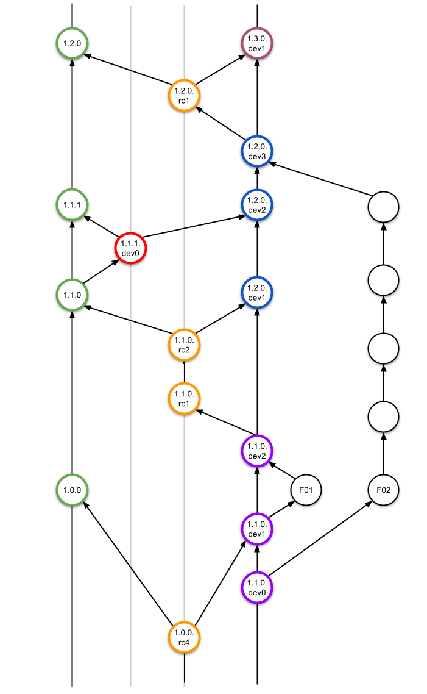

	Title: Development and release guidelines
	MEP: 1
	State: CANDIDATE
	Date: 2021-05-03
	Drivers: Jordi Andreu Segura <jandreu@cells.es>
	URL:
	Abstract:
	This MEP describes how to create releases for the mxcubecore package by adopting
      a tag schema compliant with PEP440. I proposes a git flow to structure and
      organize the repository and also propose 2 different solution for helping
      on the bumping of versions according to the different releases.
      

Introduction
============

While reaching the last part of the massive refactoring of the HardwareRepository 
(renamed to `mxcubecore`), and with the aim to converge again the code in all sites, 
it has been realized the need to adopt of a robust version model and release strategy in
order to easily track the version of the library, being the core library for the MXCuBE
`web` and `qt` applications.

Out of scope
============
The mechanism (manual or automated) to create the library package for each release and
its upload to a software repository is out of the scope of this proposal.

Glossary
========

- `Main branch:` Name adopted for the [old master branch](https://www.zdnet.com/article/github-to-replace-master-with-alternative-term-to-avoid-slavery-references/)
  
- `Release:` The distribution of a certain (final) version of an application.

- [Release Lifecycle:](https://en.wikipedia.org/wiki/Software_release_life_cycle) Set of
  actions involved in the creation of a new piece of software.

Current situation (previous to MEP1)
====================================
The [canonical repository](http://www.github.com/mxcube/mxcubecore) is hosted at 
`github.com` under the `mxcube` organization. Current development guidelines are based
on the so called [github flow](https://guides.github.com/introduction/flow/). We use a
single `main branch` to merge any `feature branch` by the mechanism of creating a PR and
its acceptance after review. There is no versioning model defined nevertheless, some
code releases have been documented using the release tag feature from GitHub.

The MXCuBE project is currently under a massive refactoring of the `mxcubecore` library.
Although the amount of code that has been already refactored is non-negligible, we
still foresee important changes in the API defined so far. This fact together with the
need to easily track the version of the library used at each different site, makes the
adoption of a versioning model a tool to effectively address this challenges.

Goals & considerations
======================

The following lists the main goals taken into consideration for this proposal:

1. A release schema have to provide a clear versioning of the code at different stages.ç
   This will facilitate the identification of the code used at any time.

2. Each release should provide a comprehensive list of changes with all additions and 
   changes.
  
3. Any non-backward compatible change on the code must be discussed and agreed by the 
   developers, any new feature must be backward compatible with the existent code and 
   any bug fix must be also be backward compatible.

4. We need to adopt development and release guidelines according to the project nature:
   code need to be tested with site-specific hardware and is difficult to perform functional
   tests covering most of the scenarios.
  

Implementation
==============

This section presents some technical solutions and tools proposed to achieve the proposed
goals:

## Development guidelines

We propose the adoption of the well known [gitflow](https://nvie.com/posts/a-successful-git-branching-model/))
branching model. We can summarize the most important procedures in this model as:

- Each new feature is implemented in a `feature branch`, branching from the `development branch`.

- The merge of a `feature branch` is made via PR to the `develop branch`. The author of 
  the PR must solve any conflicts with the latest development version before the merge.

- When decided, a release branch is created from the development branch and becomes
  a release candidate version.

- Once the code can be released, the release branch is merged to the `main branch` and
  also to the `develop branch`.
  
- If a bug is found in a released version, a `hotfix branch` is created with the 
  necessary changes and applied to the `main branch` and the corresponding commits are
  also cherry-picked to the development branch.

## Versioning guidelines

- The commits of the code proposed to be versioned are:
  - Any merge commit to the `develop branch`.
  - Any commit in the `release branch`.
  - Any merge commit to the `main branch`.
  
- Even if the [semantic versioning](https://semver.org/) is widely used as a model for 
  versioning software, the general schema described in the [PEP440](https://www.python.org/dev/peps/pep-0440/)
  seems more convenient to define a model aligned with the development guidelines 
  proposed in this document.
  
- We will use the segments `major.minor.patch` to assign a version released from the 
  `main branch` (this is compliant with semantic versioning).

- We will use the segment `.devN` as a suffix when versioning in the `development branch`. 
  At this stage, the patch segment could also be omitted (i.e. `major.minor.devN`) 
  
- We will use the segment `.rcN` when versioning in the `release branch`. 
  This `release candidate` version is intended for the developers' community.

This is an example of different transitions when bumping the version:

- `bump version dev`: 0.1.0.dev0 -> 0.1.0.dev1
  
- `bump version release`: 0.1.0.dev0 -> 0.1.0.rc0

- `bump version dev`: 0.1.0.rc0 -> 0.1.0.rc1
  
- `bump version release`: 0.1.0.rc1 -> 0.1.0

- `bump version major`: 0.1.0 -> 1.0.0.dev0

- `bump version minor`: 0.1.0 -> 0.2.0.dev0

- `bump version patch`: 0.1.0 -> 0.1.1.dev0

The following figure illustrates the implementation of this versioning schema on a
gitflow branching model.

*Version model proposed in a gitflow chart example.* 

## Versioning models
Here two different models for versioning a package are presented. A complete list of 
options for python projects can be found [here](https://packaging.python.org/guides/single-sourcing-package-version/).

### Option 1: Bumpversion model
A first option is using [bumpversion](https://github.com/c4urself/bump2version) as a
tool to tag the different versions. In this case, `bumpversion` assumes that the version
string is writen in (at least) one project file. When bumping the version, `bumpversion`
will search for the current version string, will calculate the next version
according to the segment to bump and will replace the old version string by the new one.
In addition, a tag can be also added to the repository, making easier the identification
between the version tag and the code.

However, this means that after bumping the version, you have local changes on the repository
that need to be committed at some point.

The proposed version flow configuration can be implemented using [this](bumpversion.cfg) 
`bumpversion` configuration file.

### Option 2: Tag model
A second option is not to hardcode the version in the project files, but calculated
dynamically from the git repository information. When using `git` as a VCS, you can use
`git tags` to version you code, being the unique source of truth for the code version.

This approach requires to always work with the repository project as sources in order
to obtain the version tag for the code when creating a release of the code. A python
module [setuptools_scm](https://pypi.org/project/setuptools-scm/) provide several tools
for implementing such tag versioning models and support git and mercurial VCSs.

In addition, the operation to tag the repository can be automated making use of the
`GitHub Actions` and there exist projects [here](https://github.com/anothrNick/github-tag-action)
implementing actions to automatically tag the repository triggered by events (for
instance, a git push to a certain branch after a PR accepted).

## Keep track of the repository changes

A `changelog` file should be used to track the changes of the different versions released.
This will require a dedicated commit on the corresponding branch.

We propose to follow the guidelines from [keepachangelog](https://keepachangelog.com/en/1.0.0/).
The changelog file will be updated manually at each merge commit in different situations:

- Adding an entry at the `Unreleased` changes section of the changelog when merging any
  feature branch to the development branch.
  
- Moving the content of the `Unreleased` section to a new `Release` section in the changelog.

All changes in a release will be grouped using the most appropriate category from the 
recommended list: `Added`, `Changed`, `Deprecated`, `Removed`, `Fixed` and `Security`.

## Version numbers and their interpretation

### Interpretation of versions

The naming practice follows directly from the use of [PEP440](https://www.python.org/dev/peps/pep-0440/) 
and the description in the preceding sections, but some interpretation might be helpful: 
All version numbers are with reference to a final, public release. Thus e.g. versions 1.2.0.dev4, and 
1.2.0.rc2 are both part of the preparations *preceding* release 1.2.0. Similarly version 1.2.1.dev1 
is part of the *preparation* of the (patch) release 1.2.1, and thus is derived from release 1.2.0.
This should make it clear when and how we need to bump versions.

### Local versions

We may not want to give explicit version numbers to local beamline-specific code, 
but it would be useful to agree on the correct way to do it, even so. Following
PEP440, local versions must conform to the API of the official release they match, 
and are indicared by a suffix starting with '+'. I would recommend that we agree
on starting the local version identifier with a beamline identifier. Thus version 
1.2.1+ESRF.3 would be an ESRF-specific version that conformed to the 1.2.1 API except
for beamline-specific code (which we have agreed is not considered when deriving 
version numbers).The last field in the identifier (the '3') is strictly speaking 
free text, so beamlines can deal with it as they wish, though they might find it 
practical to include some kind of consecutive numbering. 

### What versions to bump

I would propose we should follow the following sequence when we make a release.
This should pretty much match the diagram above.
Supposing we want to make a release from version 1.1.0.dev12:

- First push version 1.1.0.dev12 to the release branch under the name 1.1.0rc0

- Then bump the version of the development branch to 1.2.0.dev0. 
  Future development will be happening under this tag.

- After finishing with the release candidates (say we are at 1.1.0rc2) 
  we push the candidate to the master branch as 1.1.0, and merge the 
  accumulated changes into the development branch, incrementing the final
  number to (e.g.) 1.2.0.dev1. 
  
- Further development will be happening under 1.2.0.dev, increasing only 
  the last number (to .dev2, .dev3, ...) no matter how many features are added.
  
- When we decide for changes in the major version we bump the major version at
  the start of the process (2.0.0.dev0).
  
- PEP440 and the first version of this document are not quite clear (IMHO)
  on how we should handle patch levels. I would propose that increases in patch
  level are only done by forking directly from a release, e.g. from 1.2.0 to 1.2.1rc0,
  and further proceding as for other release candidates. This makes the system
  a lot simpler, and frees us from having to consider in the development branch 
  whether we are planning to add new features or not.
  
I have assumed that we want to start new branches at patch level 0. This seems 
sensible (to me), but we can opt for starting at .1 if we so pr3efer.
 
  
License
=======

The following copyright statement and license apply to MEP1 (this
document).

Copyright (c) 2021 Jordi Andreu Segura

Permission is hereby granted, free of charge, to any person obtaining
a copy of this software and associated documentation files (the
"Software"), to deal in the Software without restriction, including
without limitation the rights to use, copy, modify, merge, publish,
distribute, sublicense, and/or sell copies of the Software, and to
permit persons to whom the Software is furnished to do so, subject to
the following conditions:

The above copyright notice and this permission notice shall be included
in all copies or substantial portions of the Software.

THE SOFTWARE IS PROVIDED "AS IS", WITHOUT WARRANTY OF ANY KIND,
EXPRESS OR IMPLIED, INCLUDING BUT NOT LIMITED TO THE WARRANTIES OF
MERCHANTABILITY, FITNESS FOR A PARTICULAR PURPOSE AND NONINFRINGEMENT.
IN NO EVENT SHALL THE AUTHORS OR COPYRIGHT HOLDERS BE LIABLE FOR ANY
CLAIM, DAMAGES OR OTHER LIABILITY, WHETHER IN AN ACTION OF CONTRACT,
TORT OR OTHERWISE, ARISING FROM, OUT OF OR IN CONNECTION WITH THE
SOFTWARE OR THE USE OR OTHER DEALINGS IN THE SOFTWARE.

Changes
=======

2021-05-03
[Jordi Andreu](https://github.com/jordiandreu/): Creation of MEP1

2022-01-25
[Rasmus Fogh](https://github.com/rhfogh/): Added section "Version numbers and their interpretation".
