# MXCuBE Architecture

**MXCuBE** (Macromolecular Xtallography Customized Beamline Environment) is a modular framework for controlling synchrotron beamlines for macromolecular crystallography experiments.

This documentation was partly generated automatically and is meant to provide an architectural overview of the concepts involved. It may miss implementation details.

## Table of Contents

- [System Overview](#system-overview)
- [High-Level Architecture](#high-level-architecture)
- [MXCubeCore Architecture](#mxcubecore-architecture)
- [MXCubeWeb Architecture](#mxcubeweb-architecture)
- [Communication Flow](#communication-flow)
- [Data Collection Workflow](#data-collection-workflow)
- [Key Components](#key-components)

______________________________________________________________________

## System Overview

MXCuBE is split into two main repositories:

- **mxcubecore**: Hardware abstraction layer and core business logic
- **mxcubeweb**: Web-based user interface and REST/WebSocket API server

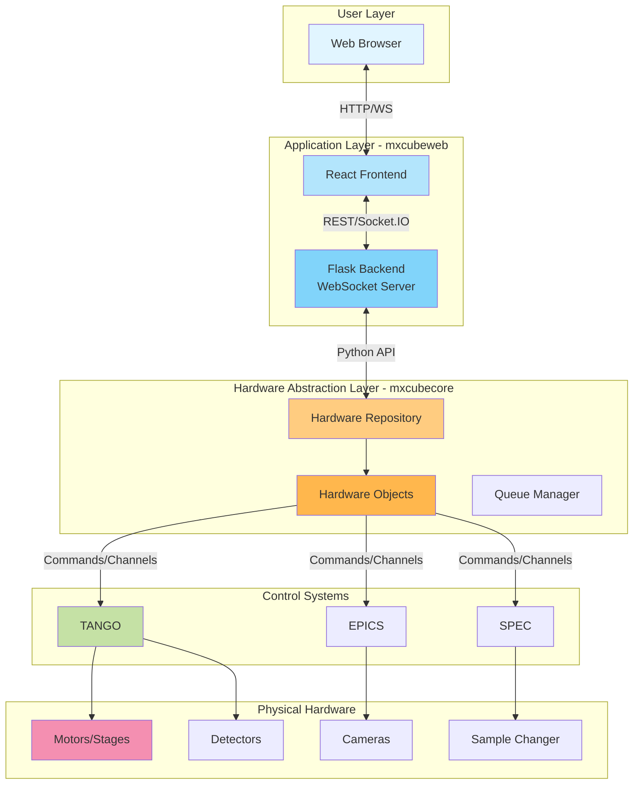

______________________________________________________________________

## High-Level Architecture

### Three-Tier Architecture

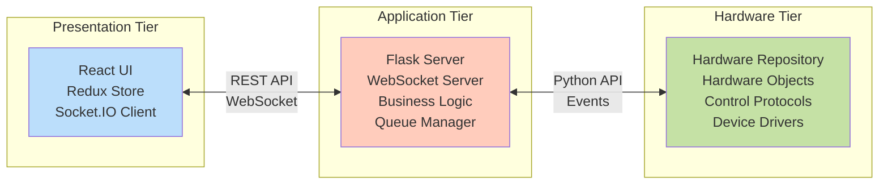

______________________________________________________________________

## MXCubeCore Architecture

### Core Component Hierarchy

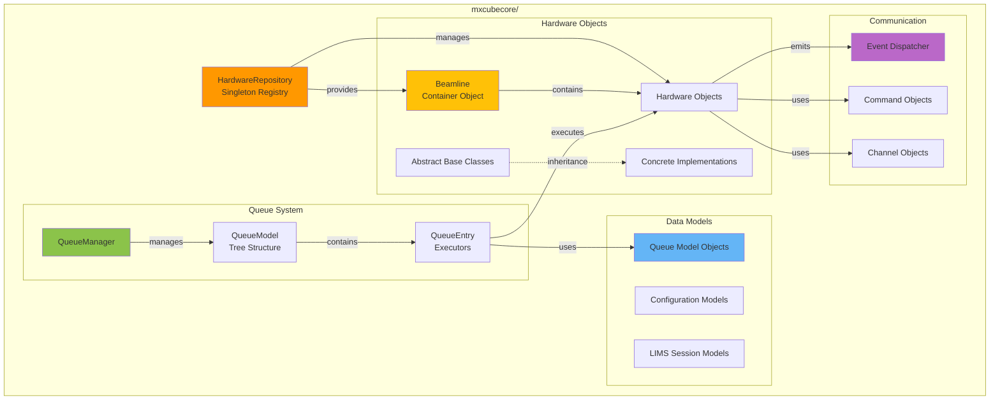

### Hardware Object Base Classes

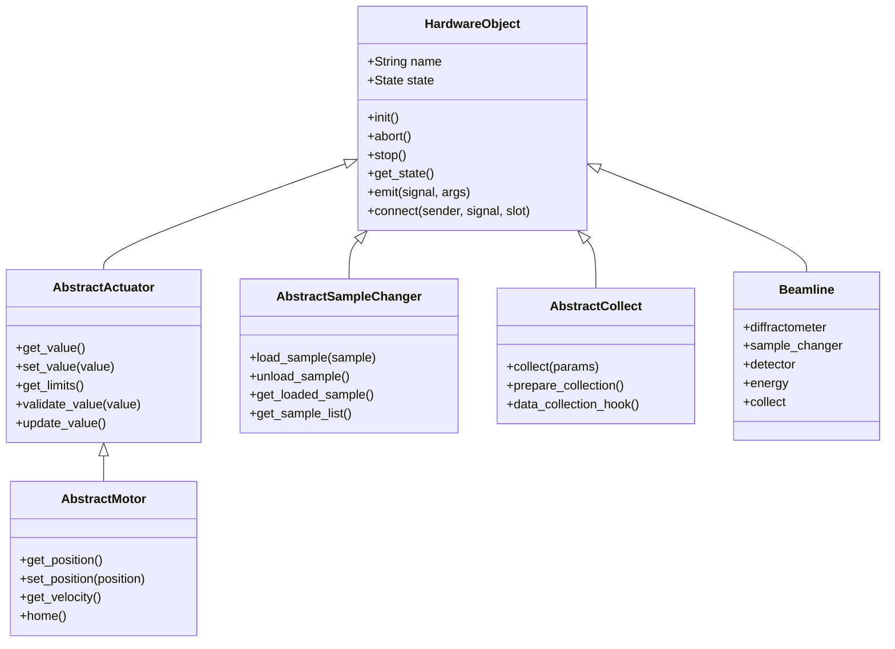

### Hardware Repository Pattern

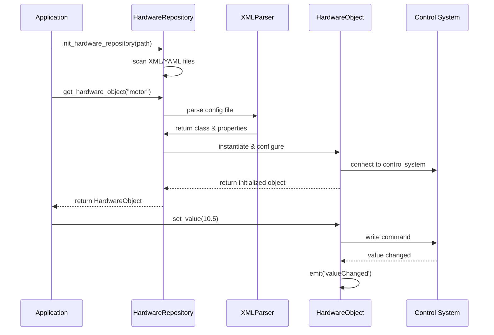

### Queue Execution Model

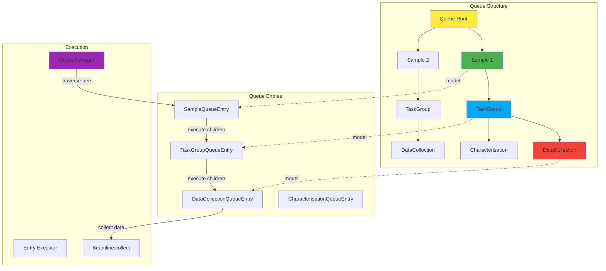

______________________________________________________________________

## MXCubeWeb Architecture

### Backend Architecture

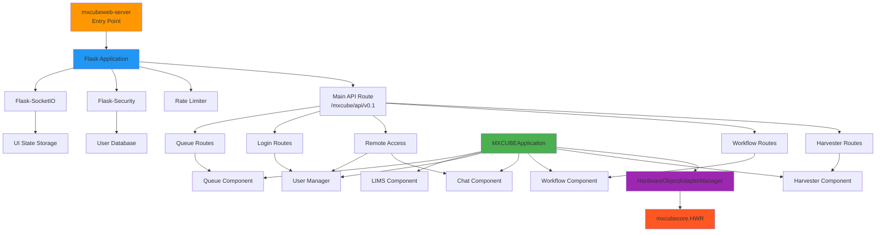

### Frontend Architecture

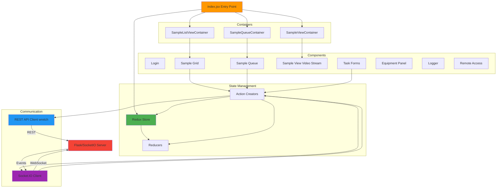

### Component Communication

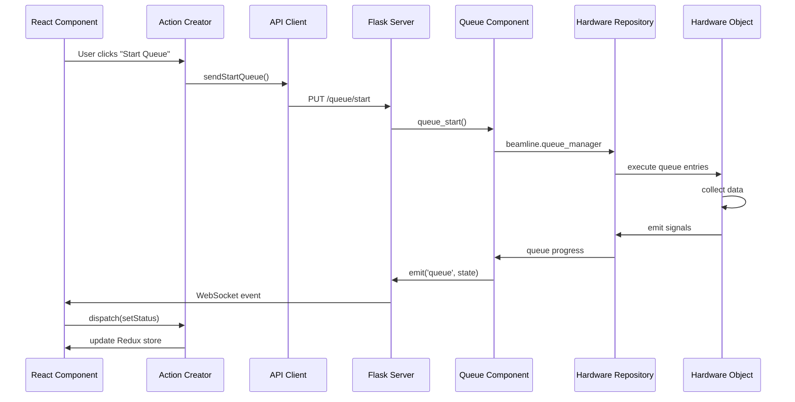

______________________________________________________________________

## Communication Flow

### REST API Flow

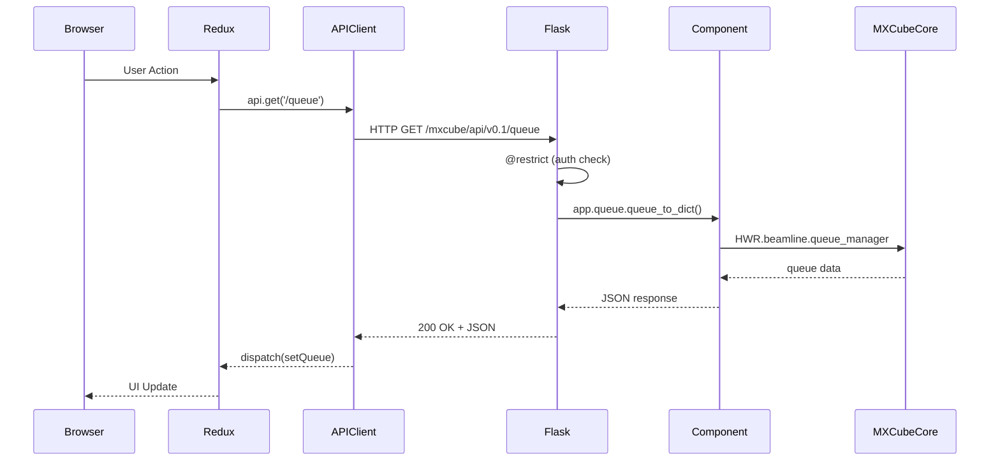

### WebSocket Event Flow

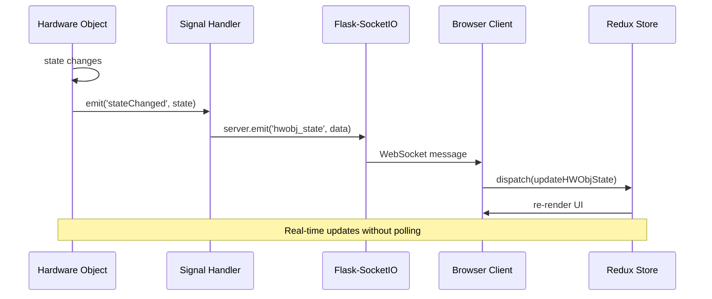

### Data Collection Signal Flow

```mermaid
graph LR
    subgraph "Hardware Layer"
        Det[Detector]
        Motor[Goniometer]
    end

    subgraph "Control Layer"
        Collect[CollectHWObj]
        DC[DataCollectionEntry]
    end

    subgraph "Queue Layer"
        QM[QueueManager]
        QE[QueueEntry]
    end

    subgraph "Application Layer"
        QComp[Queue Component]
        Signal[Signal Handler]
    end

    subgraph "Frontend"
        Socket[Socket.IO]
        UI[React UI]
    end

    Det -->|frames collected| Collect
    Motor -->|position reached| Collect
    Collect -->|progress| DC
    DC -->|status| QE
    QE -->|emit| QM
    QM -->|queue_entry_execute_started| QComp
    QComp -->|format message| Signal
    Signal -->|emit event| Socket
    Socket -->|WebSocket| UI

    style Det fill:#c5e1a5
    style Collect fill:#ffcc80
    style QM fill:#81d4fa
    style Signal fill:#ce93d8
    style UI fill:#90caf9
```

______________________________________________________________________

## Data Collection Workflow

### End-to-End Data Collection

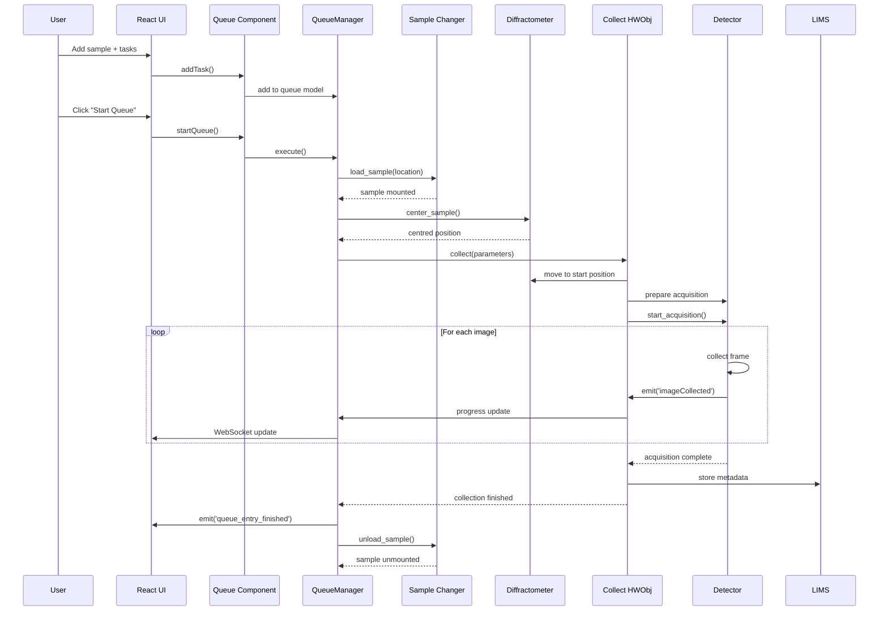

### Queue Tree Execution

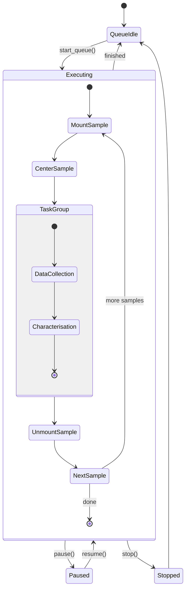

______________________________________________________________________

## Key Components

### 1. Hardware Repository (mxcubecore)

**Purpose**: Central registry and factory for hardware objects

**Key Features**:

- Singleton pattern for global access (`HWR.beamline.*`)
- Dynamic loading from XML/YAML configurations
- Lazy initialization of hardware objects
- Event-driven communication via dispatcher

**Example**:

```python
from mxcubecore import HardwareRepository as HWR

# Access hardware objects
HWR.beamline.diffractometer.move_motors({"omega": 90})
HWR.beamline.detector.prepare_acquisition()
```

### 2. Hardware Objects

**Purpose**: Abstract hardware control behind unified interfaces

**Key Base Classes**:

- `HardwareObject`: Base class with state management
- `AbstractActuator`: Values and limits (motors, energy, etc.)
- `AbstractSampleChanger`: Sample loading/unloading
- `AbstractCollect`: Data collection orchestration

**Control System Adapters**:

- TANGO (Tango Controls)
- EPICS (Experimental Physics and Industrial Control System)
- SPEC (Python wrapper for Spec diffractometer control)

### 3. Queue System

**Purpose**: Manage and execute data collection workflows

**Components**:

- `QueueModel`: Tree structure of samples and tasks
- `QueueEntry`: Executable nodes with `execute()` method
- `QueueManager`: Traversal and execution engine

**Queue Entry Types**:

- `SampleQueueEntry`: Mount/unmount operations
- `DataCollectionQueueEntry`: Standard data collection
- `CharacterisationQueueEntry`: Crystal characterisation
- `WorkflowQueueEntry`: Multi-step workflows
- `TaskGroupQueueEntry`: Group related tasks

### 4. MXCUBEApplication (mxcubeweb)

**Purpose**: Application-level business logic and state

**Components**:

- `Queue`: Queue management API
- `Lims`: LIMS integration (ISPyB, etc.)
- `UserManager`: Authentication and authorization
- `Chat`: Remote access collaboration
- `Workflow`: Advanced workflows (GPhL, etc.)
- `Harvester`: Crystal harvester integration

### 5. Signal System

**Purpose**: Decouple components via event-driven architecture

**Pattern**:

```python
# Hardware object emits signal
self.emit("valueChanged", new_value)

# Application listens
HWR.beamline.motor.connect("valueChanged", callback)
```

**Signal Flow**:
Hardware Object → Dispatcher → Signal Handler → Flask-SocketIO → Browser

### 6. React Frontend

**Purpose**: Modern web UI with real-time updates

**Stack**:

- React 18 + Redux for state management
- Socket.IO for real-time communication
- Vite for fast builds
- Bootstrap for styling

**Key Containers**:

- `SampleListViewContainer`: Sample management and LIMS
- `SampleQueueContainer`: Queue visualization and control
- `SampleViewContainer`: Video stream and sample centering
- `TaskParametersContainer`: Data collection forms

______________________________________________________________________
