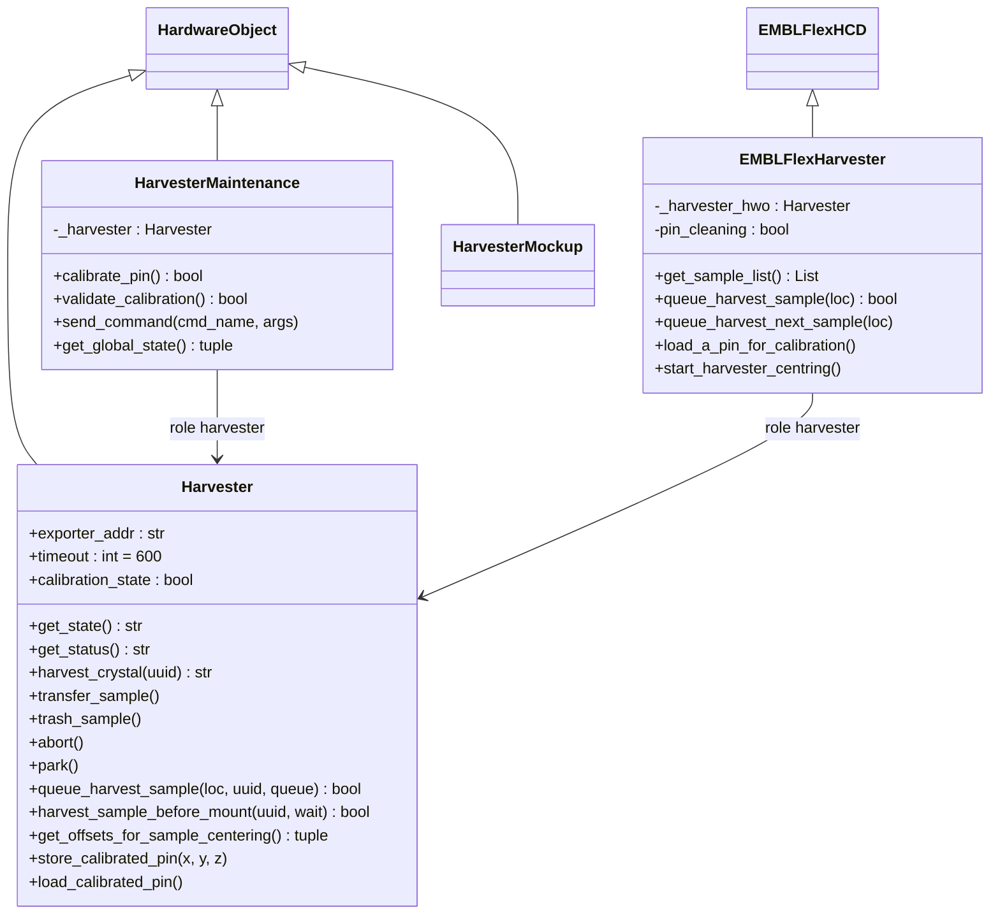
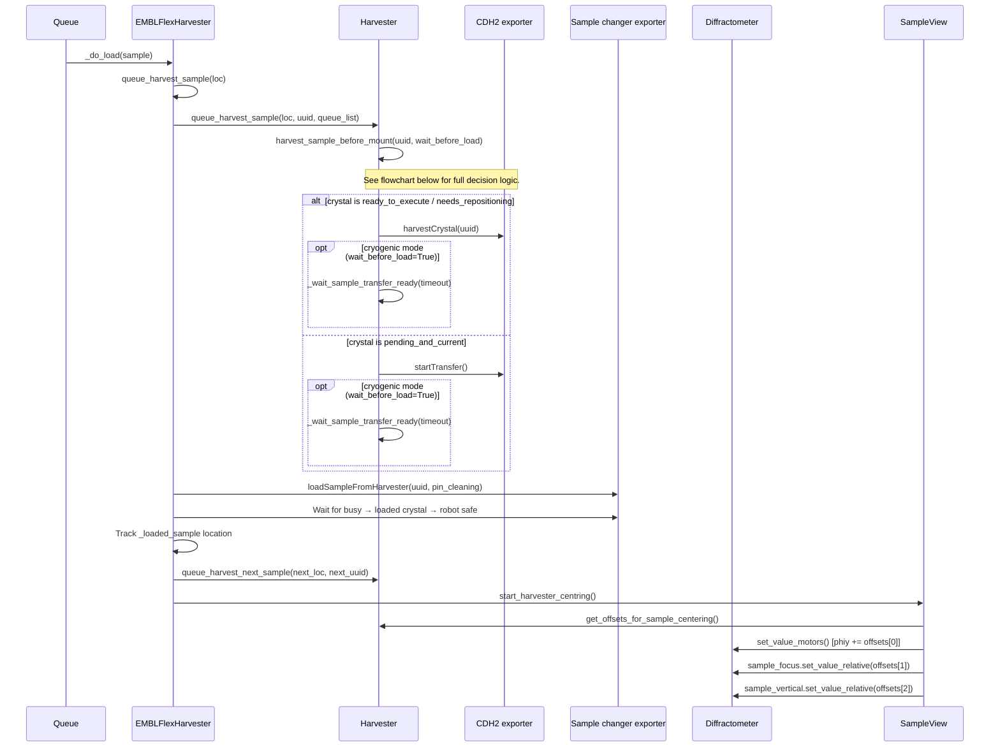
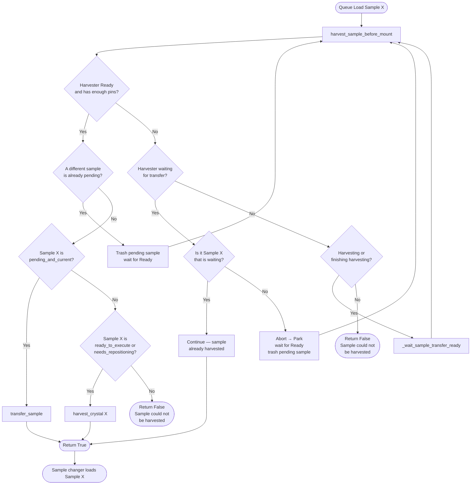
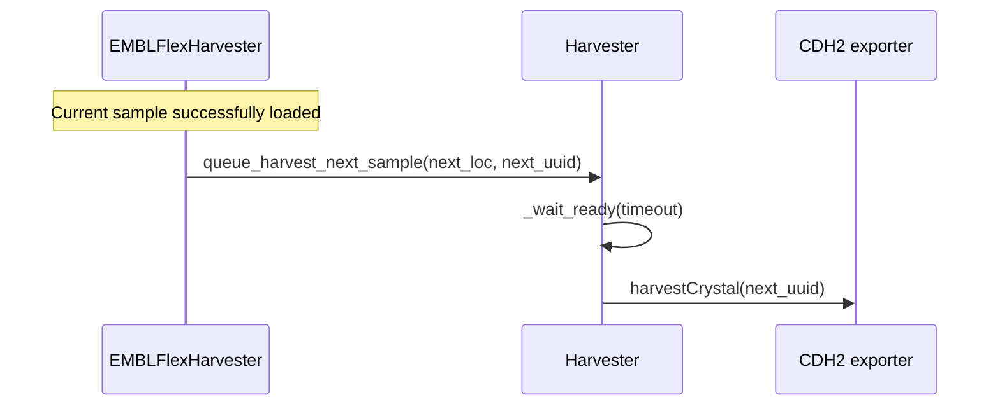
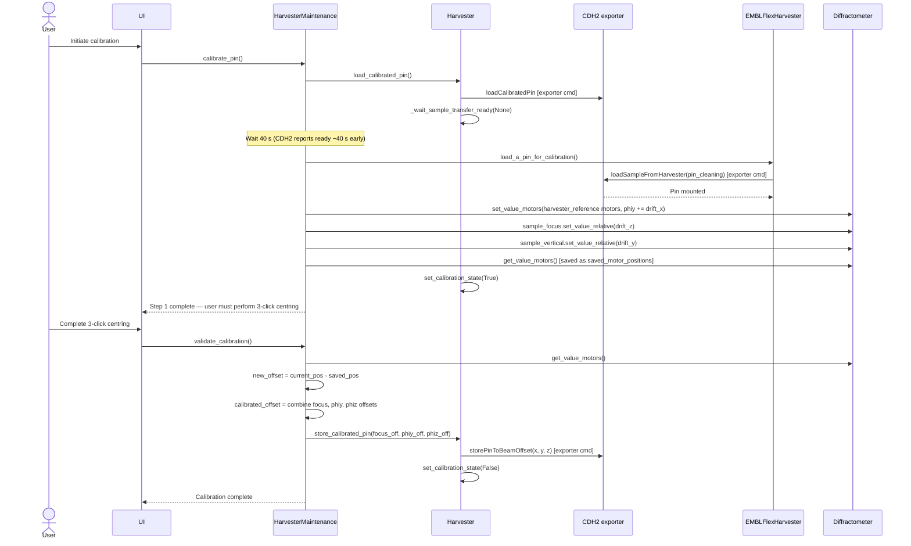

# Harvester

The Harvester integration lets MXCuBE treat a **CrystalDirect Harvester 2** (CDH2)
machine as the source of samples instead of a conventional cryogenic dewar.
The CDH2 cuts crystals directly from a crystallisation plate, mounts them on a
pin, and hands them off to the sample changer for loading onto the diffractometer.

The integration was developed for **MASSIF-1** at ESRF/EMBL — a fully automated,
high-throughput beamline for macromolecular crystallography where data collection
parameters are optimised for every sample without user intervention.

## Data collection modes

The code documented here covers two data collection modes:

| Mode                      | Description                                                                                                            |
| ------------------------- | ---------------------------------------------------------------------------------------------------------------------- |
| **Cryogenic temperature** | Crystal harvested and cryo-cooled before mounting; sample changer waits for `"Waiting Sample Transfer"` before loading |
| **Room temperature**      | Crystal mounted without cryo-cooling; sample changer loads the pin directly without waiting for the transfer state     |

The mode is read and written via `get_room_temperature_mode()` /
`set_room_temperature_mode()` on the `Harvester` object. The web route for
`set_room_temperature_mode` synchronises this flag across the Harvester, the
sample changer, and the diffractometer in a single call.

## Full data pipeline

The CDH2 sits in a broader software pipeline:

```text
1. Protein crystallisation
        ↓
   CRIMS (Crystallisation Information Management System, EMBL)
        ↓ harvesting plan
2. Crystal harvesting — CrystalDirect Harvester ←→ MXCuBE
        ↓
3. Data collection — MXCuBE → ISPyB / DRAC
```

- **CRIMS** provides the harvesting plan (which crystals to harvest, in which
  order) and receives data-collection results back via `send_data_collection_info_to_crims()`.
- **ISPyB / DRAC** stores or exposes diffraction data and metadata downstream
  of MXCuBE.

## Hardware objects

The implementation is mainly split across three hardware objects:

| Class                  | Module                                    | Role                                                         |
| ---------------------- | ----------------------------------------- | ------------------------------------------------------------ |
| `Harvester`            | `HardwareObjects/Harvester.py`            | Low-level exporter interface to the CDH2 machine             |
| `HarvesterMaintenance` | `HardwareObjects/HarvesterMaintenance.py` | Maintenance commands and two-step pin calibration            |
| `EMBLFlexHarvester`    | `HardwareObjects/EMBLFlexHarvester.py`    | EMBL Flex sample changer extended to load from the harvester |

`Harvester` owns the direct calls to the CDH2; `HarvesterMaintenance` and
`EMBLFlexHarvester` use it through the `harvester` beamline role.

The common beamline roles are:

- `harvester` — the hardware object that talks to the CDH2 device.
- `harvester_maintenance` — the maintenance facade used by the web UI.
- `sample_changer` — the sample changer implementation that mounts pins prepared
  by the Harvester.

## Architecture



All CDH2 communication in `Harvester` goes through `_execute_cmd_exporter()`,
which wraps both exporter **commands** (sent via `add_command`) and exporter
**attributes** (read/written via `add_channel`).

## Harvester States

`HarvesterState` defines the possible states of the CDH2 machine.

| Value | Name                 | Status string               | Description                               |
| ----- | -------------------- | --------------------------- | ----------------------------------------- |
| 0     | `Unknown`            | —                           | State could not be determined             |
| 1     | `Initializing`       | —                           | Machine is starting up                    |
| 2     | `Ready`              | `"Ready"`                   | Idle; ready to accept a new command       |
| 3     | `Harvested`          | `"Waiting Sample Transfer"` | Crystal cut; waiting for transfer trigger |
| 4     | `Running`            | —                           | General in-progress state                 |
| 5     | `Harvesting`         | `"Harvesting 1 Crystals"`   | Actively cutting a crystal                |
| 6     | `ContinueHarvesting` | `"Finishing Harvesting"`    | Completing the harvesting cycle           |

`get_state()` returns the raw state string; `get_status()` returns the
human-readable status string shown in the table above.

## Main Hardware Objects

### `Harvester`

{py:class}`mxcubecore.HardwareObjects.Harvester.Harvester` is the
exporter-based CDH2 hardware object. During `init()` it reads the
`exporter_address`, `crims_upload_url`, and `crims_upload_key` configuration
properties. Exporter commands and channels are created lazily through
`_execute_cmd_exporter()`.

Most of the public API falls into five areas:

- **State and readiness** — `get_state()`, `get_status()`, `_wait_ready()`,
  and `_wait_sample_transfer_ready()`.
- **Processing-plan metadata** — `get_crystal_uuids()`, `get_sample_names()`,
  `get_samples_state()`, `get_sample_acronyms()`, `get_crystal_images_urls()`,
  `get_image_target_x()`, `get_image_target_y()`.
- **Device actions** — `harvest_crystal()`, `transfer_sample()`,
  `trash_sample()`, `load_plate()`, `abort()`, `park()`,
  `set_room_temperature_mode()`.
- **Queue helpers** — `queue_harvest_sample()`, `queue_harvest_next_sample()`,
  `harvest_sample_before_mount()`.
- **Calibration and centring** — `load_calibrated_pin()`,
  `store_calibrated_pin()`, `get_calibrated_pin_offset()`,
  `get_offsets_for_sample_centering()`, and drift/cut-shape offset accessors.

Two CDH2 status strings act as important state boundaries:

- `"Ready"` — the CDH2 can accept the next command.
- `"Waiting Sample Transfer"` — a harvested crystal is ready for the sample
  changer.

`_wait_sample_transfer_ready()` handles a timeout by aborting the current CDH2
action, parking the arm, waiting for `"Ready"`, trashing the pending crystal,
and raising `RuntimeError`.

### `HarvesterMaintenance`

{py:class}`mxcubecore.HardwareObjects.HarvesterMaintenance.HarvesterMaintenance`
wraps maintenance actions for the web UI. It is configured with a child object
using the `harvester` role and delegates commands such as `transfer`, `trash`,
`abort`, `loadPlateWithBarcode`, and `set_room_temperature_mode` to that child.

It also implements the two-step calibration workflow described in
[Pin Calibration](#pin-calibration).

**Emits:**

- `globalStateChanged (state_dict, cmd_state, message)` — emitted by
  `_update_global_state()` when that method is called explicitly. It is not
  connected to the web component; the web component subscribes to
  `stateChanged` and `harvester_contents_update` on `HWR.beamline.harvester`
  directly.

### `EMBLFlexHarvester`

{py:class}`mxcubecore.HardwareObjects.EMBLFlexHarvester.EMBLFlexHarvester` is
the EMBL Flex sample changer implementation used together with the Harvester.
It inherits from `EMBLFlexHCD` and expects a child hardware object with the
`harvester` role.

During normal queue execution it does three things: enriches the sample list
with Harvester metadata (UUIDs, names, states, images), drives pre-harvesting
before the robot load, and starts automatic centring after a sample is mounted.
It also resolves queue location strings to crystal UUIDs, issues
`loadSampleFromHarvester` on the sample changer exporter, waits for robot safe
state, and optionally pre-harvests the next queued sample in cryogenic mode.

### `HarvesterMockup`

`mxcubecore.HardwareObjects.mockup.HarvesterMockup.HarvesterMockup` implements
the same public API as `Harvester` and returns static data. It is the default
class for the standard MXCuBE-Web demo configuration and for development without
physical hardware.

## Configuration

### Beamline objects

Enable the integration by declaring three hardware objects in the beamline
configuration:

```yaml
objects:
  !!omap
  - sample_changer: sample_changer.yaml
  - harvester: harvester.yaml
  - harvester_maintenance: harvester_maintenance.yaml
```

### Harvester object (YAML)

```yaml
%YAML 1.2
---
class: Harvester.Harvester
configuration:
  exporter_address: harvester-host:9001
  crims_upload_url: https://crims.example.org/upload
  crims_upload_key: change-me
```

### Maintenance object (YAML)

```yaml
%YAML 1.2
---
class: HarvesterMaintenance.HarvesterMaintenance
configuration: {}
objects:
  harvester: harvester.yaml
```

### Sample changer (XML, EMBLFlexHarvester)

```xml
<object class="EMBLFlexHarvester">
    <username>Sample Changer</username>
    <exporter_address>flex-host:9001</exporter_address>
    <pin_cleaning>true</pin_cleaning>
    <object href="/harvester" role="harvester"/>
</object>
```

### Key configuration properties

| Property           | Object              | Description                                  |
| ------------------ | ------------------- | -------------------------------------------- |
| `exporter_address` | `Harvester`         | `host:port` of the CDH exporter interface    |
| `crims_upload_url` | `Harvester`         | Endpoint for CRIMS data-collection reporting |
| `crims_upload_key` | `Harvester`         | Authentication key for CRIMS reporting       |
| `pin_cleaning`     | `EMBLFlexHarvester` | Enable pin cleaning station on load          |

## Queue Workflow

During automated queue execution, `EMBLFlexHarvester._do_load()` orchestrates
the full harvest-to-mount sequence.



`queue_harvest_sample()` first checks the number of available pins:

- If pins are available, it delegates to `harvest_sample_before_mount()`.
- If no pins remain but a crystal is already waiting for transfer, it lets the
  current mount continue and logs that the next queue item cannot be harvested.
- If no pins remain and no crystal is waiting, it logs an error and returns
  `False`.

`harvest_sample_before_mount()` implements the following decision logic:



Failures are logged to `user_level_log`; queue-facing methods return `False` so
the queue layer can stop or fail the queue entry.

### Look-ahead harvesting

To minimise dead time between samples, `EMBLFlexHarvester` pre-harvests the
*next* sample immediately after the current one is confirmed loaded (only when
not in room-temperature mode and when pins remain):



(pin-calibration)=

## Pin Calibration

Pin calibration establishes the spatial relationship between the tip of a
harvested pin and the beam position. It must be performed before the first
sample of a session and whenever the pin geometry changes.

The procedure is split into two steps; the user performs manual 3-click centring
between them.



## Sample Centring Offsets

`Harvester.get_offsets_for_sample_centering()` computes the motor offsets needed
to automatically bring a harvested sample to the beam without user intervention.
It is called internally by `SampleView.start_harvester_centring()`.

Three offset sources are combined:

| Source                         | Accessor                                 | Axes (mm)                     |
| ------------------------------ | ---------------------------------------- | ----------------------------- |
| Stored pin-to-beam calibration | `get_calibrated_pin_offset()`            | focus (X), phiy (Y), phiz (Z) |
| Per-sample drift               | `get_last_sample_drift_offset_{x,y,z}()` | X, Y, Z                       |
| Pin cut-shape                  | `get_last_pin_cut_shape_offset_{x,y}()`  | X, Y                          |

The calculation (all values in mm):

```
phiy_offset      = drift_x  - cut_shape_x + pin_to_beam[1]
sample_focus     = drift_z                + pin_to_beam[0]
sample_vertical  = drift_y  - cut_shape_y + pin_to_beam[2]
```

`SampleView.start_harvester_centring()` applies the returned tuple by adding
`offsets[0]` to the `phiy` motor via `set_value_motors()`, then calling
`set_value_relative()` on `diffr.motors_hwobj_dict["sample_focus"]` and
`diffr.motors_hwobj_dict["sample_vertical"]`.

## Main methods

### `Harvester`

#### State and readiness

| Method                                 | Returns         | Description                                                 |
| -------------------------------------- | --------------- | ----------------------------------------------------------- |
| `get_state()`                          | `str`           | Raw state string from CDH2 (`"Ready"`, `"Running"`, …)      |
| `get_status()`                         | `str`           | Human-readable status string                                |
| `_ready` *(property)*                  | `bool`          | `True` when state is `"Ready"`                              |
| `_ready_to_transfer` *(property)*      | `bool`          | `True` when status is `"Waiting Sample Transfer"`           |
| `_wait_ready(timeout)`                 | `None`          | Block until `_ready()` or timeout                           |
| `_wait_sample_transfer_ready(timeout)` | `None`          | Block until `_ready_to_transfer()`, auto-recover on timeout |
| `get_samples_state()`                  | `List[str]`     | State of each crystal in the processing plan                |
| `get_current_crystal()`                | `str`           | UUID of the currently harvested crystal                     |
| `is_crystal_harvested(uuid)`           | `bool`          | Whether `uuid` is the current harvested crystal             |
| `current_crystal_state(uuid)`          | `str`           | State string for a specific crystal UUID                    |
| `check_crystal_state(uuid)`            | `Optional[str]` | `"pending_and_current"` / `"pending_not_current"` / `None`  |

#### Processing-plan metadata

| Method                          | Returns     | Description                                     |
| ------------------------------- | ----------- | ----------------------------------------------- |
| `get_crystal_uuids()`           | `List[str]` | All UUIDs in the current processing plan        |
| `get_sample_names()`            | `List[str]` | All names in the current processing plan        |
| `get_sample_acronyms()`         | `List[str]` | Protein acronyms in the current processing plan |
| `get_crystal_images_urls(uuid)` | `str`       | Image URL for a crystal UUID                    |
| `get_image_target_x(uuid)`      | `float`     | Crystal X coordinate on the plate (mm)          |
| `get_image_target_y(uuid)`      | `float`     | Crystal Y coordinate on the plate (mm)          |

#### Device actions

| Method                             | Returns | Description                                             |
| ---------------------------------- | ------- | ------------------------------------------------------- |
| `harvest_crystal(uuid)`            | `str`   | Send `harvestCrystal` for `uuid`; returns result string |
| `transfer_sample()`                | `None`  | Send `startTransfer` to trigger pin hand-off            |
| `trash_sample()`                   | `None`  | Discard the currently harvested crystal                 |
| `abort()`                          | `str`   | Abort any in-progress action                            |
| `park()`                           | `str`   | Park (home) the harvester arm                           |
| `load_plate(plate_id)`             | `str`   | Switch to a different plate; returns new plate ID       |
| `get_plate_id()`                   | `str`   | Return current plate ID                                 |
| `get_room_temperature_mode()`      | `bool`  | `True` when room-temperature mode is active             |
| `set_room_temperature_mode(value)` | `bool`  | Enable or disable room-temperature mode                 |

#### Queue helpers

| Method                                      | Returns | Description                                                      |
| ------------------------------------------- | ------- | ---------------------------------------------------------------- |
| `queue_harvest_sample(loc, uuid, queue)`    | `bool`  | Harvest `uuid` during queue execution; returns `True` on success |
| `queue_harvest_next_sample(next_loc, uuid)` | `None`  | Pre-harvest the next queued sample                               |
| `harvest_sample_before_mount(uuid, wait)`   | `bool`  | State-aware harvest with automatic recovery                      |

#### Calibration and centring

| Method                               | Returns        | Description                                                 |
| ------------------------------------ | -------------- | ----------------------------------------------------------- |
| `load_calibrated_pin()`              | `None`         | Ask CDH2 to prepare a calibration pin                       |
| `store_calibrated_pin(x, y, z)`      | `None`         | Write focus/phiy/phiz offsets (mm) to CDH2                  |
| `get_calibrated_pin_offset()`        | `tuple[float]` | Retrieve stored pin-to-beam offsets (mm)                    |
| `get_number_of_available_pin()`      | `int`          | Number of pins remaining in the provider                    |
| `set_calibration_state(state)`       | `None`         | Mark calibration in progress (`True`) or complete (`False`) |
| `get_last_sample_drift_offset_x()`   | `float`        | Last per-sample drift offset X (mm)                         |
| `get_last_sample_drift_offset_y()`   | `float`        | Last per-sample drift offset Y (mm)                         |
| `get_last_sample_drift_offset_z()`   | `float`        | Last per-sample drift offset Z (mm)                         |
| `get_last_pin_cut_shape_offset_x()`  | `float`        | Last pin cut-shape offset X (mm)                            |
| `get_last_pin_cut_shape_offset_y()`  | `float`        | Last pin cut-shape offset Y (mm)                            |
| `get_offsets_for_sample_centering()` | `tuple[float]` | `(phiy_offset, centringFocus, centringTableVertical)` in mm |

### `HarvesterMaintenance`

| Method                         | Returns | Description                                                       |
| ------------------------------ | ------- | ----------------------------------------------------------------- |
| `calibrate_pin()`              | `bool`  | Execute step 1 of the two-step pin calibration; `True` on success |
| `validate_calibration()`       | `bool`  | Execute step 2 after user 3-click centring; `True` on success     |
| `get_global_state()`           | `tuple` | `(state_dict, cmd_state, message)` for UI consumption             |
| `get_cmd_info()`               | `list`  | Command descriptor list consumed by the maintenance UI            |
| `send_command(cmd_name, args)` | `bool`  | Dispatch a maintenance command by name                            |

Available `send_command` names: `"transfer"`, `"trash"`, `"park"`, `"abort"`,
`"loadPlateWithBarcode"`, `"set_room_temperature_mode"`.

**Emits:**

- `globalStateChanged (state_dict, cmd_state, message)` — emitted by
  `_update_global_state()` when called explicitly; not automatically connected
  to the web layer.

### `EMBLFlexHarvester`

Inherits all methods from `EMBLFlexHCD`. Harvester-specific additions:

| Method                                   | Returns       | Description                                                                                                                                  |
| ---------------------------------------- | ------------- | -------------------------------------------------------------------------------------------------------------------------------------------- |
| `get_sample_list()`                      | `List`        | Samples enriched with UUID, state, image URL, name, and protein acronym                                                                      |
| `get_sample_uuid(loc)`                   | `str \| None` | Resolve a location string to a crystal UUID                                                                                                  |
| `queue_list()`                           | `List[str]`   | Location strings for all samples in the queue model                                                                                          |
| `queue_harvest_sample(loc)`              | `bool`        | Resolve UUID and delegate to `Harvester.queue_harvest_sample()`                                                                              |
| `queue_harvest_next_sample(loc)`         | `None`        | Pre-harvest the next queued sample                                                                                                           |
| `load_a_pin_for_calibration()`           | `bool`        | Mount a calibration pin via `loadSampleFromHarvester`                                                                                        |
| `start_harvester_centring()`             | `None`        | Delegate to `HWR.beamline.sample_view.start_harvester_centring()`, which fetches offsets and moves `phiy`, `sample_focus`, `sample_vertical` |
| `harvest_and_mount_sample(uuid, sample)` | `bool`        | One-shot interactive harvest and mount                                                                                                       |
| `get_room_temperature_mode()`            | `bool`        | Reads room-temperature mode from the **sample changer's own exporter** (independent of the CDH2 exporter)                                    |
| `set_room_temperature_mode(value)`       | `bool`        | Writes room-temperature mode on the sample changer exporter; the web route additionally syncs `sample_changer` and `diffractometer` together |

## MXCuBE-Web Integration

`mxcubeweb.core.components.harvester.Harvester` is created at application
startup. It reads `HWR.beamline.harvester` and exposes:

- **Initial state** — status, contents, maintenance command info, global state,
  and plate mode.
- **Contents** — name, crystal list, available pin count, calibration state,
  room-temperature mode flag, and whether the active sample changer can mount
  from the harvester.
- **Crystal list entries** — UUID, name, state, protein acronym, image URL, and
  image-target coordinates.
- **CRIMS reporting** — for CDH2 samples only: listens on
  `queue_entry_execute_finished` and calls
  `Crims.send_data_collection_info_to_crims()` in a background greenlet after
  each successful collection. Standard sample changer samples are not affected.
  The reported metadata includes the crystal UUID, sample name, instrument,
  facility, and investigation ID.

The Flask route module `mxcubeweb.routes.harvester` exposes HTTP endpoints under
`/harvester`:

| Method | Endpoint                          | Description                             |
| ------ | --------------------------------- | --------------------------------------- |
| `GET`  | `/crystal_list`                   | Return the current crystal list         |
| `GET`  | `/harvester_state`                | Return the current harvester state      |
| `GET`  | `/get_harvester_initial_state`    | Return full initial state payload       |
| `GET`  | `/contents`                       | Return harvester contents               |
| `POST` | `/harvest`                        | Harvest a crystal by UUID               |
| `POST` | `/harvest_and_mount`              | Harvest and immediately mount a crystal |
| `GET`  | `/calibrate`                      | Start pin calibration (step 1)          |
| `POST` | `/validate_calibration`           | Finish calibration (step 2)             |
| `GET`  | `/send_command/<cmdparts>/<args>` | Send a maintenance command              |

The component also forwards `stateChanged` and `harvester_contents_update`
signals from the hardware object to the web client over the `/hwr` socket
namespace.

### Harvester UI tab

The **Harvester** tab in MXCuBE-Web (`Harvester.jsx`) shows:

- The current harvester state (e.g. `READY`) and **Number Of Available Pins**.
- A **Refresh** button.
- A scrollable crystal grid — one card per crystal in the processing plan,
  each showing the crystal image, plate/well label (e.g. `CD037488_H07-1`),
  and a colour-coded state badge.
- A right-click context menu per crystal: **Harvest crystal** / **Harvest & load sample**.

Crystal state badges visible in the UI:

| Badge       | Meaning                                               |
| ----------- | ----------------------------------------------------- |
| `harvested` | Crystal has been successfully cut and placed on a pin |
| `failed`    | Harvesting attempt failed for this crystal            |

The **HarvesterMaintenance** panel (`HarvesterMaintenance.jsx`) shows:

- **Actions** group (labels from `HarvesterMaintenance.get_cmd_info()`):
  `Transfer sample`, `Trash sample`, `Park`, `Abort`.
- **Plate Barcode** — displays `Actual Plate Barcode is: <id>` with a `Set`
  input to load a plate by barcode.
- **Temperature Mode** — `InOutSwitch` toggling between `Room Temperature`
  and `Cryo Temperature`; dispatches `set_room_temperature_mode`.
- **Procedure** section:
  - When `calibration_state` is `False`: **Calibrate** button → `calibratePin()`.
  - When `calibration_state` is `True` (calibration in progress): instruction
    text *"Please align the tip of the pin with the center of the beam"*,
    then **Validate Calibration** and **Cancel Calibration** buttons.

## Extending the Implementation

When adding support for a new harvester machine, subclass `Harvester` and
override `init()` and/or `_execute_cmd_exporter()` to replace the exporter
protocol with REST calls, TANGO access, or any other transport.

```python
from mxcubecore.HardwareObjects.Harvester import Harvester


class MyHarvester(Harvester):
    """Harvester implementation for MyMachine."""

    def init(self):
        self._base_url = self.get_property("http_address")
        super().init()

    def _execute_cmd_exporter(self, cmd, *args, **kwargs):
        # Replace with REST / TANGO / ... calls
        ...
```

Public methods required by `HarvesterMaintenance` and `EMBLFlexHarvester`:

- `get_state()`, `get_status()`
- `harvest_crystal(uuid)`, `transfer_sample()`, `trash_sample()`, `abort()`, `park()`
- `get_crystal_uuids()`, `get_sample_names()`, `get_samples_state()`, `get_sample_acronyms()`
- `get_crystal_images_urls(uuid)`, `get_image_target_x(uuid)`, `get_image_target_y(uuid)`
- `load_calibrated_pin()`, `store_calibrated_pin(x, y, z)`, `get_calibrated_pin_offset()`
- `get_last_sample_drift_offset_{x,y,z}()`, `get_last_pin_cut_shape_offset_{x,y}()`
- `get_number_of_available_pin()`
- `get_room_temperature_mode()`, `set_room_temperature_mode(value)`
- `set_calibration_state(state)`

Recommended checks before merging a harvester change:

- Update or add the relevant hardware-object configuration files.
- Keep `HarvesterMockup` compatible when the public API changes.
- Preserve the queue-facing return values (`bool`) of `queue_harvest_sample()`
  and `harvest_sample_before_mount()`.
